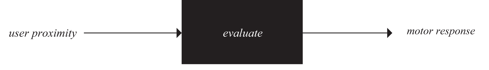
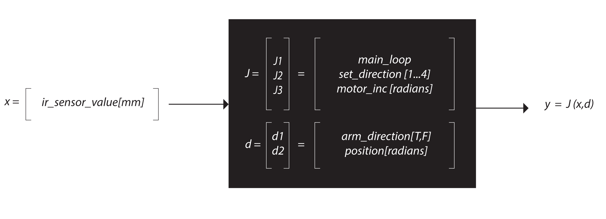
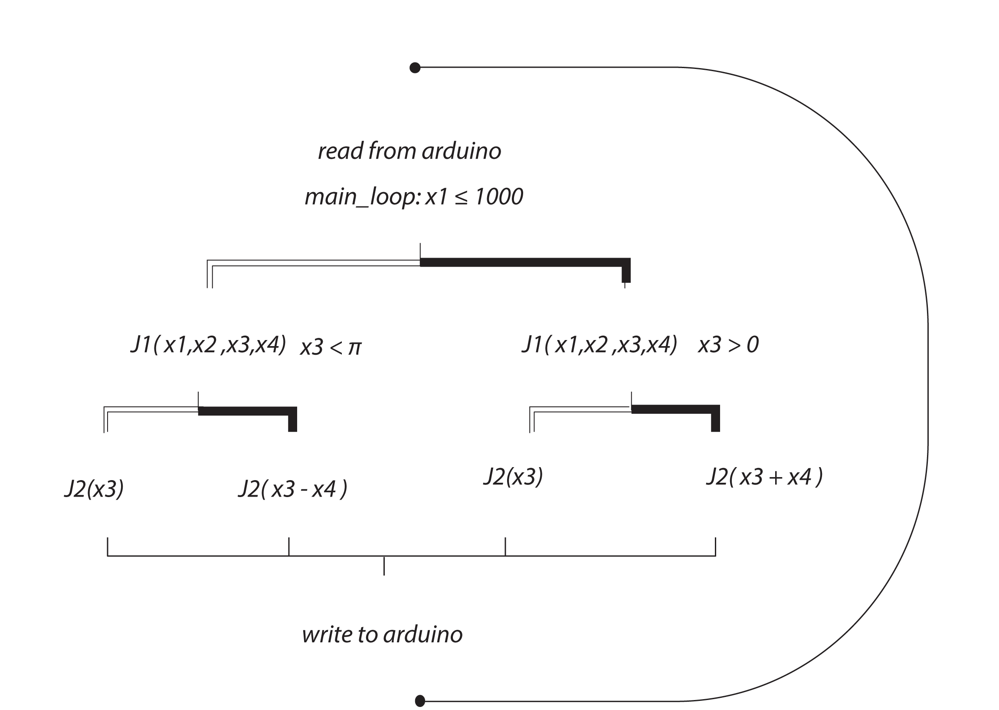

Field Guide
=======

##### Description
Field Guide is an arduino-based, responsive installation for Toronto's Gladstone Hotel. The Field Guide code is open source, made available under the GNU General Public License. For details see the LICENSE file.

 

   

 

   

 

   

 

=======

##### Legal Stuff
    Copyright (C) 2013-2014  F_RMlab

    This program is free software: you can redistribute it and/or modify
    it under the terms of the GNU General Public License as published by
    the Free Software Foundation, either version 3 of the License, or
    (at your option) any later version.

    This program is distributed in the hope that it will be useful,
    but WITHOUT ANY WARRANTY; without even the implied warranty of
    MERCHANTABILITY or FITNESS FOR A PARTICULAR PURPOSE.  See the
    GNU General Public License for more details.

    You should have received a copy of the GNU General Public License
    along with this program.  If not, see <http://www.gnu.org/licenses/>.

